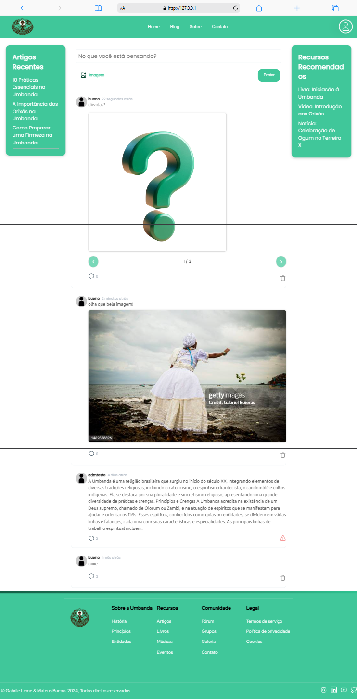

# Diálogo Inter-Religioso

Bem-vindo ao projeto Diálogo Inter-Religioso! Este site foi criado com o objetivo de fomentar o entendimento mútuo e a harmonia entre pessoas de diferentes tradições religiosas.

## Funcionalidades do Site

- **Home:** Página inicial com informações sobre o projeto e sua missão.
- **Questionário:** Um questionário interativo para os usuários responderem.
- **Login:** Funcionalidade de login para acesso a recursos adicionais.
- **Blog:** Usuários logados podem:
  - Postar artigos.
  - Comentar em postagens.
  - Denunciar conteúdos inadequados.
  - Postar fotos.

## Tecnologias Utilizadas

**Frontend:**
- HTML
- CSS
- JavaScript (com jQuery)

**Backend:**
- PHP (utilizando a biblioteca Carbon)

**Banco de Dados:**
- MySQL

**Responsividade:**
- Design adaptável para dispositivos móveis

## Estrutura do Projeto

- `index.php`: Página inicial do site.
- `login.php`: Página de login.
- `blog.php`: Página principal do blog.

## Instalação

1. Clone este repositório:

```git
- git clone https://github.com/Buenno0/website.git
```

2. Configure o banco de dados MySQL:

- Crie um banco de dados chamado **db_site** e importe o arquivo db_site.sql.
- Configure o arquivo de conexão com o banco de dados (config.php):

```php
<?php
$conn = mysqli_connect("localhost", "root", "", "db_site");
if (!$conn) {
  die("Connection failed: " . mysqli_connect_error());
} 
?>
```

## Capturas de Tela





## Licença
Este projeto está licenciado sob a licença MIT. 